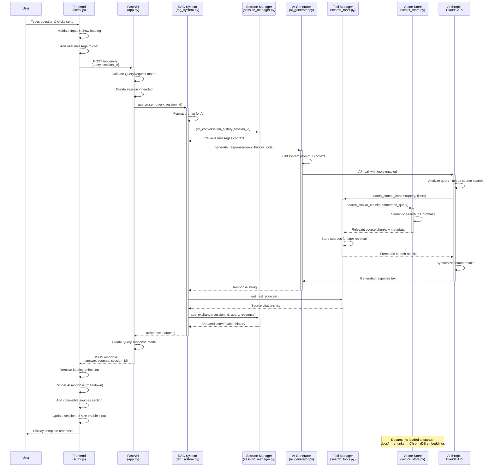
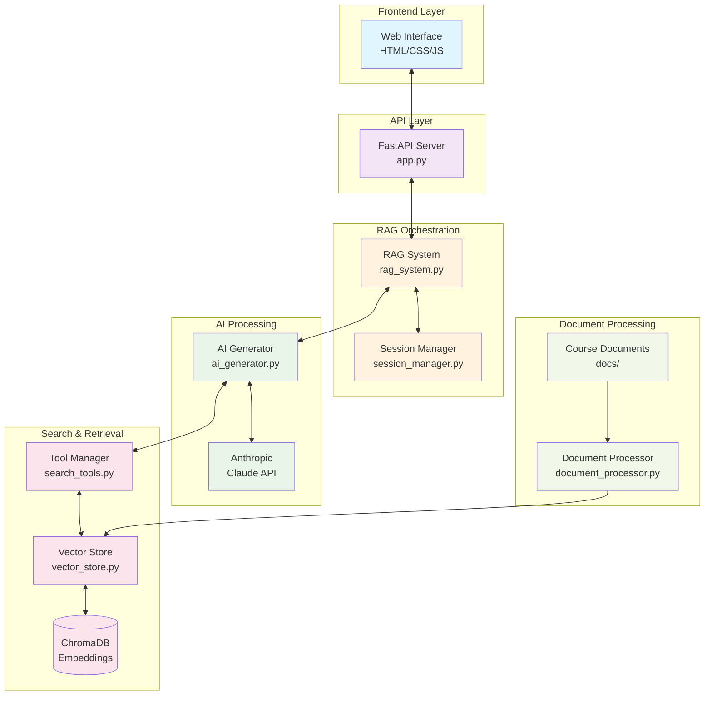

# RAG System Query Flow Diagram

## Architecture Overview

## Data Flow Summary

1. **User Query** → Frontend validation & UI updates
2. **HTTP Request** → FastAPI endpoint with session management
3. **RAG Orchestration** → Coordinates components & manages context
4. **AI Processing** → Claude analyzes query & decides on tool usage
5. **Vector Search** → Semantic search through course embeddings
6. **Response Generation** → Claude synthesizes results into answer
7. **Source Tracking** → Citations collected from search tools
8. **Session Update** → Conversation history maintained for context
9. **Response Delivery** → Structured JSON back to frontend
10. **UI Rendering** → Markdown response with collapsible sources

The system maintains **conversational context** through session management and provides **accurate citations** through the tool-based search approach, creating a seamless educational assistant experience.